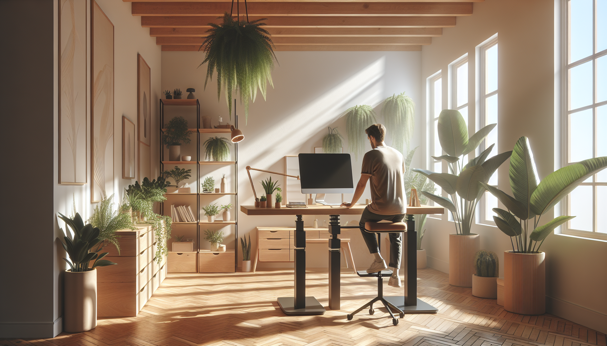

---
authors:
  - sdargoeuves
categories:
  - Writing
date:
  created: 2025-02-21
draft: false
title: 'Getting started with the blog'
---

Late in 2024, I decided to start writing my own blog. This post is about the journey to get to what you are now reading...
<!-- more -->

I used to keep my notes scattered across random files in multiple directories. Let's just say, it isn't the most efficient way to keep track of what I did, especially when I needed to refer back to something I did a few months ago.

So here we are, ready to start a blog! What should I do next? I've heard a lot of good things about Hugo, so I decided to give it a try.

## Starting with Hugo

It was pretty straightforward to get the blog up and running. Check the [Hugo Quick Start Guide](https://gohugo.io/getting-started/quick-start/) and you're good to go. It was the steps *after* that I found more challenging: choosing a theme and customization.

I know there are a lot of themes available, but I just couldn't find one that really clicked with me. Instead of actually writing, I got completely bogged down trying to find the perfect theme. Each one I tried seemed to be missing something, or had a feature that didn't quite work the way I wanted -- things like Search or Table of Contents. After spending quite some time on this, I decided to look for another solution that would suit my needs better.

And please, don't get me wrong, I have absolutely nothing against Hugo! It might be the perfect solution for many, but it just didn't quite click for *my* needs.

## Choosing MkDocs

At our company, we use MkDocs for our documentation, and more precisely `Material for MkDocs`. I like the simplicity, the look and the fact it's written in python *-- not that I am planning to dive into the code.*

When I saw that they have a [plugin for blog](https://squidfunk.github.io/mkdocs-material/plugins/blog/), it did it for me! I decided to give it a try. And also, 22k stars on GitHub, it's a good sign, right? 😅

## Discovering my needs

Looking back, this is probably where I should have started – figuring out my needs first. But the problem was, I didn't really know what I needed! It was only when I started playing around with Hugo and different themes that things became clearer, and I began to figure out what I didn't like or what was missing.

Now that I had a clearer picture, here's what was on my wishlist:

- [x] Write my posts in Markdown
- [x] No CSS required and very little HTML
- [x] A clean and simple design
- [x] Easy to navigate
- [x] A search function
- [x] A table of contents, that follows you as you scroll

I really feel like a lot of those are covered with Hugo, but I struggled especially with the search function and the table of contents. I wasn't fully satisfied with the different themes I tried. With Material for MkDocs, all of these points are covered right out of the box, which was a huge relief.

## Starting with Material for MkDocs

The best way to start with Material for MkDocs is to follow the [Getting Started](https://squidfunk.github.io/mkdocs-material/getting-started/). It's very well written and easy to follow. I won't go into the details here, they've done a much better job than I could ever do.

## My MkDocs setup

To set up this blog, I wanted a pretty simple and standard workflow: edit markdown files, use Git to push those file somewhere and update the blog accordingly.

I initially considered GitHub Pages, but switched to [Cloudflare Pages](https://www.cloudflare.com/pages/) after hearing about it from Ivan Pepelnjak (on his [blog](https://blog.ipspace.net/2024/07/blog-cloudflare/)) and discovering Deborah Writes' excellent deployment guide: [Deploy and Host MkDocs with Cloudflare Pages guide](https://deborahwrites.com/guides/deploy-host-mkdocs/deploy-mkdocs-material-cloudflare/)

The source code is hosted on [GitHub](https://github.com/sdargoeuves/noodleops-mkdocs), and updates are automatically deployed to Cloudflare Pages when I update the `main` branch.

The overall look of this blog was influenced by existing resources:

- **Inspirational Tech Writing Blog:** [Deborah Writes](https://deborahwrites.com/blog/)
- **Material for MkDocs Blog:** [Material for MkDocs Blog](https://squidfunk.github.io/mkdocs-material/blog/)
- **Additional MkDocs Examples:** [Andre_601](https://andre601.ch/blog/), [Tim Vink](https://timvink.nl/blog/), [A code to remember](https://copdips.com/)...

## Conclusion

That's it! The foundations are finally in place, or at least, at a point I'm happy with! No more excuses, no more distractions. I can finally stop tinkering with blog setup and actually start writing... now, where to begin?

/// caption
This image almost looks like my office... minus the wooden floor, the plants, the size of the room, the windows, the furniture... fair enough, it doesn't look like my office at all!
///
