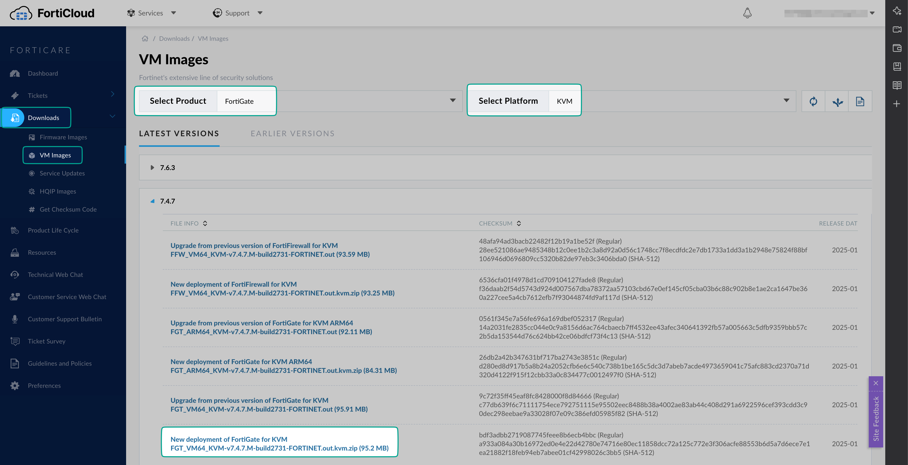
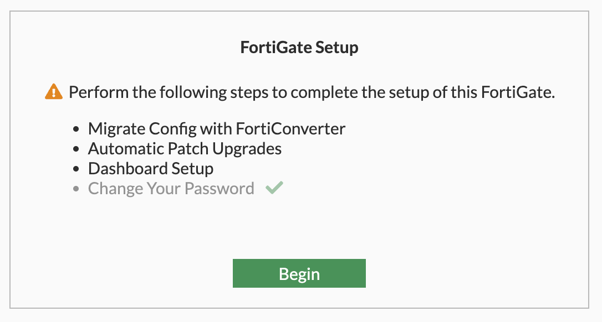
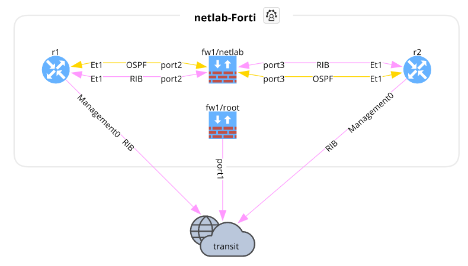

---
authors:
  - sdargoeuves
categories:
  - netlab
date:
  created: 2025-06-06
  updated: 2025-06-15
draft: false
tags:
  - netlab
  - security
title: "Add a FortiGate in your virtual lab: from qcow to netlab by creating a Vagrant box"
---

Want to test FortiGate in your virtual lab environment, and want to do **without** purchasing a license 💰? Discover how to spin up a FortiGate VM in your virtual lab, using the qcow image, Vagrant, and leveraging the power of *netlab*.

<!-- more -->

![AI generated image - The image depicts two technicians working on a network system. One technician is kneeling and connecting cables to a large piece of equipment, while the other is perched on a stool, using a laptop and drawing on a digital tablet. In the background, a glowing, interconnected globe with a keyhole symbolizes cybersecurity and data protection, surrounded by various icons representing technology and security. Tools and devices are scattered around them, indicating a busy work environment focused on networking and security systems.](fortigate-qcow-to-netlab-01.jpeg){ width=600 }
/// caption
<!-- keep empty to center the image, without a caption -->
///

## Introduction

!!! info "Disclaimer"
    Many steps described in this blog post are based on the great work of [Pete Crocker](https://www.linkedin.com/in/petercrocker/) in his post: [Creating a Fortinet VM for Libvirt/vagrant](https://blog.petecrocker.com/post/fortinet_vagrant_libvirt/).

My goal here is to create an updated guide to deploy a FortiGate in a virtual lab environment, as the licensing has changed from the version `7.2.0`. It's mentioned in the [containerlab instructions](https://containerlab.dev/manual/kinds/fortinet_fortigate/#fortinet-fortigate). You may still be able to obtain a version `< 7.2.0` of the FortiGate, with a 15 day license, but I couldn't find it on the Fortinet support portal anymore...

In this post, I'll be using the version `7.4.8`, to help you get started with setting up your virtual lab environment. It works just as well with the version `7.6.3`, which is the latest version available at the time of writing.

!!! tip "Licensing"
    Before you start, please note that the free license provided by Fortinet is great for experiencing their FortiGate, but it has some restrictions, which could affect what you want to achieve.

    You can find the documentation about the [FortiGate VM free license](https://docs.fortinet.com/document/fortigate/7.4.8/administration-guide/441460) on the Fortinet website.

## Prerequisites

To follow this guide, we will assume:

!!! note "Environment"
    You have an environment with KVM, Vagrant and the Vagrant plugin `vagrant-libvirt` already installed. You can check steps 1 and 2 of this [post](https://computingforgeeks.com/using-vagrant-with-libvirt-on-linux/) to prepare your environment.

!!! note "FortiGate VM image"
    You have an account on the [Fortinet support portal](https://support.fortinet.com/) to download the FortiGate VM image, or an alternative way to obtain the `fortios.qcow2` image.

!!! note "*netlab*"
    You have a working installation of *netlab*, if not, check their [installation guide](https://netlab.tools/install/).

## Overview

There are only a *few* steps to follow in order to get the FortiGate VM ready for use in *netlab*. We will deep dive into each step, but here is a quick overview of what we will do:

- [Image preparation](#image-preparation)

    1. Download the FortiGate VM image from the Fortinet support portal, selecting the KVM option

    2. Create the VM with `virt-install`

    3. Configure the FortiGate VM with some basic settings: admin password, DHCP, DNS, and activate the permanent evaluation license

    4. Keep note of the UUID of the VM, as it will be used in the *netlab* configuration

    5. Shut down the VM

- [Create the Vagrant box](#create-the-vagrant-box)

    1. Create a metadata file that will be used to create the Vagrant box

    2. Download the box creation script from the vagrant-libvirt repository

    3. Execute the box creation script to create the Vagrant box from the FortiGate VM qcow2 image

    4. (Optional) Move the Vagrant box to a different location

    5. Prepare the json file for the Vagrant box, so that it can be added to Vagrant with the correct version number

    6. Add the box to Vagrant

    7. Cleanup the FortiGate VM from libvirt, so that it can be used with *netlab*

- [Create a lab using *netlab*](#create-a-lab-using-netlab)

    1. Create a topology file for *netlab* with the FortiGate VM and other devices

    2. Start the lab with *netlab*

## Image preparation

### 1. Download the FortiGate VM image

You can download the FortiGate VM image from the [Fortinet support portal](https://support.fortinet.com/), you will need an account to access it.

Once logged in, navigate to the **Download** section and select **VM Images**.



From there, it should show **FortiGate** for the Select Product, and select **KVM** for the Select Platform. Select the version of the FortiGate VM you want to use, and download the appropriate image for your architecture. Once you extract the downloaded archive, you'll find the `fortios.qcow2` file:

```bash title="Extract the qcow2 image from the downloaded archive"
unzip FGT_VM64_KVM-v7.4.8.M-build2795-FORTINET.out.kvm.zip
```

### 2. Create the VM with virt-install

We've already discussed how to use `virt-install` to create a VM in a [previous post](../2025-03-deploy-debianvm-via-cli/index.md). Here, we will use it to create the FortiGate VM using the downloadeded `fortios.qcow2` image.

```bash title="Start the FortiGate VM with virt-install"
sudo virt-install \
    --connect=qemu:///system \
    --name="fortios748-vm" \
    --os-type=generic \
    --arch=x86_64 \
    --cpu host \
    --vcpus=1 \
    --hvm \
    --ram=2048 \
    --disk path="/path/to/fortios.qcow2",bus="ide",format=qcow2 \
    --network=network:"default",model="virtio" \
    --graphics none \
    --import
```

```bash {: .no-copy}
Starting install...
Connected to domain fortios748-vm
Escape character is ^]

System is starting...
Formatting shared data partition ... done!
Starting system maintenance...
Scanning /dev/sda1... (100%)
Scanning /dev/sda2... (100%)
Serial number is FGVMEV82Pxxxxxxx


FortiGate-VM64-KVM login: 
```

### 3. Configure the FortiGate VM

1. Log in with username `admin` and *empty* password
2. Set the new admin password to `admin`

    ```bash {: .no-copy}
    FortiGate-VM64-KVM login: admin
    Password:
    You are forced to change your password. Please input a new password.
    New Password:
    Confirm Password:
    Welcome!

    FortiGate-VM64-KVM #
    ```

3. Apply the default configuration below, which you can find in the output of the command `netlab libvirt config fortios`

  !!! warning "Password prompt in FortiOS 7.6.x"
      If you are using FortiOS 7.6.x, you will be prompted for the admin password twice:

      ```fortios {: .no-copy}
      FortiGate-VM64-KVM (vagrant) # set password ENC SH28SLSP20eURl8us/aceUFwjdJOggVKBfSQSP8eZi2dyoNferE+lgfmTIitbE=
      Please enter current administrator password: *****

      FortiGate-VM64-KVM (vagrant) # next
      Please enter current administrator password: *****
      ```

    ```bash title="Default configuration for the FortiGate VM"
    config system admin
        edit "vagrant"
            set accprofile "super_admin"
            set ssh-public-key1 "ssh-rsa AAAAB3NzaC1yc2EAAAABIwAAAQEA6NF8iallvQVp22WDkTkyrtvp9eWW6A8YVr+kz4TjGYe7gHzIw+niNltGEFHzD8+v1I2YJ6oXevct1YeS0o9HZyN1Q9qgCgzUFtdOKLv6IedplqoPkcmF0aYet2PkEDo3MlTBckFXPITAMzF8dJSIFo9D8HfdOV0IAdx4O7PtixWKn5y2hMNG0zQPyUecp4pzC6kivAIhyfHilFR61RGL+GPXQ2MWZWFYbAGjyiYJnAmCP3NOTd0jMZEnDkbUvxhMmBYSdETk1rRgm+R4LOzFUGaHqHDLKLX+FIPKcF96hrucXzcWyLbIbEgE98OHlnVYCzRdK8jlqm8tehUc9c9WhQ== vagrant insecure public key"
            set password ENC SH28SLSP20eURl8us/aceUFwjdJOggVKBfSQSP8eZi2dyoNferE+lgfmTIitbE=
        next
    end
    config system interface
        edit "port1"
            set vdom "root"
            set mode dhcp
            set allowaccess ping https ssh http fgfm
        next
    end
    config system dns
        set primary 1.1.1.1
    end
    ```

4. Activate the permanent evaluation license

    ```bash title="Activate the permanent evaluation license"
    execute vm-license-options account-id <your-account-id>
    execute vm-license-options account-password <your-password>
    execute vm-license
    ```

    This is the output you will get:

    ```bash {: .no-copy}
    FortiGate-VM64-KVM # execute vm-license-options account-id me@my-email.com

    FortiGate-VM64-KVM # execute vm-license-options account-password <your-password>

    FortiGate-VM64-KVM # execute vm-license
    This VM is using the evaluation license. This license does not expire.
    Limitations of the Evaluation VM license include:
    1.Support for low encryption operation only
    2.Maximum of 1 CPU and 2GiB of memory
    3.Maximum of three interfaces, firewall policies, and routes each
    4.No FortiCare Support
    This operation will reboot the system !
    Do you want to continue? (y/n)y

    Requesting FortiCare Trial license, proxy:(null)

    VM license install succeeded. Rebooting firewall.
    FortiGate-VM64-KVM # 
    ```

5. ***(Optional)*** Connect to the UI via a web browser for the FortiGate setup wizard

  !!! info "Optional step"
      This step is optional, but doing the setup before creating your Vagrant box means you won't have to repeat it every time you start a *netlab* lab.

      If you skip this step, you will have to run through the setup every time you spin up a FortiGate VM in *netlab*, but **only** if you want to use the web UI!
    
    You can connect to the FortiGate VM via a web browser using the IP address assigned by DHCP. The default username is `admin` and the password is the one you set in step 2. To find the IP address assigned by DHCP, you can use the `get system interface` command in the FortiGate VM CLI:

    ```fortios title="Get the IP address assigned by DHCP"
    get system interface
    ```

    ```fortios {: .no-copy}
    == [ port1 ]
    name: port1   mode: dhcp    ip: 192.168.122.154 255.255.255.0   status: up    netbios-forward: disable    type: physical   ring-rx: 0   ring-tx: 0   netflow-sampler: disable    sflow-sampler: disable    src-check: enable    explicit-web-proxy: disable    explicit-ftp-proxy: disable    proxy-captive-portal: disable    wccp: disable    drop-overlapped-fragment: disable    drop-fragment: disable    mtu-override: disable
    [...]
    ```

    Once logged in, you should see a page like this one:
    

  - **Migrate Config with FortiConverter**: the license does not allow you to use the FortiConverter, so you can skip this step.

  - **Automatic Patch Upgrades**: you can enable this option if you want to receive automatic updates for the FortiGate VM.

  - **Dashboard Setup**: I've used the optimal dashboard, but you can choose the option that suits you best.

  !!! tip "SSH forwarding"
      If you can't reach the FortiGate VM's IP address directly from your computer, you can use SSH forwarding via the server running netlab to access it. For example, the FortiGate VM's IP address in my setup is ⁠`192.168.122.3`.

      ```bash
      ssh -fNL 9998:192.168.122.3:443 user@my-netlab-server
      ```

      After running the command, you can access the FortiGate VM UI by navigating to `⁠https://localhost:9998` in your web browser.

### 4. Keep note of the UUID of the VM

We want to keep a record of the UUID. This ensures that *netlab* creates the FortiGate in the future with the same UUID. If the UUID changes, the license will not work properly, as it's tied to both the UUID and the Serial Number of the VM.

More information on license activation can be found on this [on this discussion page](https://community.fortinet.com/t5/FortiGate/Technical-Note-VM-License-activation/ta-p/190534), and another article specifically details an [issue with licensing due to a different UUID](https://community.fortinet.com/t5/FortiSwitch/Troubleshooting-Tip-License-invalid-due-to-exceeding-allowed-0/ta-p/355054).

You can find the UUID of the VM by using the `virsh` command with the name of the VM you created with `virt-install`. In this case, the name is `fortios748-vm`.

```bash title="Get the UUID of the FortiGate VM"
virsh dominfo fortios748-vm | grep UUID
```

```bash {: .no-copy}
UUID:           eb0603f4-0d27-43a5-b123-682dec123456
```

You can also find it directly on the FortiGate using the CLI, but it won't have the format we want to use later in the topology file for *netlab*. The command to use is:

```fortios title="Get the Serial Number and UUID of the FortiGate VM"
diagnose hardware sysinfo vm full
```

```fortios {: .no-copy}
FGVMEV82Pxxxxxxx # diagnose hardware sysinfo vm full
UUID:     eb0603f40d2743a5b123682dec123456
valid:    1
status:   1
code:     0
warn:     0
copy:     0
received: 4294939521
warning:  4294939521
recv:     202505182336
dup:
```

### 5. Shut down the VM

It is best to turn off the VM before creating the box, so it isn't running when you create the box. Let's do it from the FW CLI:

```bash title="Connect to the FortiGate VM via virsh console"
virsh console fortios748-vm
```

```bash {: .no-copy}
Connected to domain fortios748-vm
Escape character is ^]


FGVMEVT8CK0CM4B0 login: admin
Password:
Verifying password...

Welcome!

FGVMEVT8CK0CM4B0 #
```

```fortios title="Shut down the FortiGate VM"
execute shutdown
```

```fortios {: .no-copy}
FGVMEVT8CK0CM4B0 # execute shutdown
This operation will shutdown the system !
Do you want to continue? (y/n)y


System is shutting down...


The system is going down NOW !!

FGVMEVT8CK0CM4B0 #
The system is halted.
```

## Create the Vagrant box

This is the part strongly inspired by the steps described on [Pete's blog](https://blog.petecrocker.com/post/fortinet_vagrant_libvirt/).

### 1. Create a metadata file that will be used to create the Vagrant box

In the same directory, create a file called `metadata.json` with the following contents:

```bash title="Create the metadata file"
echo '{"provider":"libvirt","format":"qcow2","virtual_size":1}' > metadata.json
```

### 2. Download the box creation script

The good folks who maintain the vagrant-libvirt plugin have a script that can be used to convert qcow2 images to a Vagrant box. Download the libvirt conversion script:

```bash title="Download the box creation script"
curl -O https://raw.githubusercontent.com/vagrant-libvirt/vagrant-libvirt/master/tools/create_box.sh
```

### 3. Execute the box creation script

```bash title="Create the Vagrant box from the FortiGate VM qcow2 image"
bash create_box.sh fortios-7.4.8.qcow2
```

This will create a Vagrant box file called `fortios-7.4.8.box` in the current directory. This file is the image that will be used by Vagrant to spin up the FortiGate VM.

```bash {: .no-copy}
{2}
==> Creating box, tarring and gzipping
./metadata.json
./Vagrantfile
./box.img
Total bytes written: 282531840 (270MiB, 43MiB/s)
==> fortios-7.4.8.box created
==> You can now add the box:
==>   'vagrant box add fortios-7.4.8.box --name fortios-7.4.8'
```

### 4. (Optional) Move the Vagrant box to a different location

In my situation, all my Vagrant boxes are stored in `/var/lib/libvirt/images/`, so I will move the box file to that location. You can skip this step if you want to keep the box file in the current directory.

```bash title="Copy the Vagrant box to a different location"
sudo cp fortios-7.4.8.box /var/lib/libvirt/images/
sudo chown libvirt-qemu:kvm /var/lib/libvirt/images/fortios-7.4.8.box
```

### 5. Prepare the json file for the Vagrant box

Create a metadata file called `fortios.json` so that the Vagrant box is added with the correct version number.

!!! note
    The file path should be updated to the full path name of either your current working directory, or where you copied the box file to in the previous step.

```bash title="Create the fortios.json file"
cat << EOF > fortios.json
{
  "name": "fortinet/fortios",
  "description": "Fortinet FortiOS VM",
  "versions": [
    {
      "version": "7.4.8",
      "providers": [
        {
          "name": "libvirt",
          "url": "file:///var/lib/libvirt/images/fortios-7.4.8.box"
        }
      ]
    }
  ]
}
EOF
```

### 6. Add the box to Vagrant

```bash title="Add the box to Vagrant"
vagrant box add fortios.json
```

```bash {: .no-copy}
==> box: Loading metadata for box 'fortios.json'
    box: URL: file:///home/sa/vendors/fortinet/fortinet-FGT-v7.4.8/fortios.json
==> box: Adding box 'fortinet/fortios' (v7.4.8) for provider: libvirt
    box: Unpacking necessary files from: file:///var/lib/libvirt/images/fortios-7.4.8.box
==> box: Successfully added box 'fortinet/fortios' (v7.4.8) for 'libvirt'!
```

You can confirm that the box has been added by running the following command:

```bash title="List the Vagrant boxes"
vagrant box list
```

```bash {: .no-copy}
cisco/iosv                  (libvirt, 15.6T)
cisco/nexus9300v            (libvirt, 10.3.1.F)
cisco/nxos                  (libvirt, 9.2.2)
fortinet/fortios            (libvirt, 7.4.8)
generic/ubuntu2004          (libvirt, 4.1.14)
juniper/vsrx3               (libvirt, 21.3R1.9)
vyos/current                (libvirt, 20240817.00.20)
```

!!! tip "Check where the Vagrant boxes are stored"
    If you want to see the volumes created by Vagrant, you can run the following command:
    ```bash
    sudo virsh vol-list --pool default
    ```

🥳 Great job, we now have a Vagrant box ready to be used!

### 7. Cleanup

To ensure we can use the FortiGate VM with *netlab*, you first need to shut down the one currently running and remove its definition from libvirt. Use the following command:

```bash title="Remove the FortiGate VM from virsh"
sudo virsh destroy fortios748-vm
sudo virsh undefine fortios748-vm
```

## Create a lab using *netlab*

### 1. Topology file

We need to tell *netlab* how we want to create our lab. The lab definition is done in a file called `topology.yml`. Here is an example of a lab with a FortiGate VM connected to two Arista cEOS devices. The Arista devices are created using containerlab, while the FortiGate VM uses the Vagrant box we just created.

```yaml title="topology.yml"
---
message: "Lab with FortiGate"
defaults.devices.eos.clab.image: "ceos:4.29.9.1M"
defaults.devices.fortios.libvirt.image: "fortinet/fortios:7.4.8"
provider: libvirt

groups:
  routers:
    _auto_create: true
    device: eos
    provider: clab
    module: [ ospf ]
    members: [ r1, r2 ]
nodes:
  fw1:
    device: fortios
    module: [ ospf ]
    libvirt.uuid: eb0603f4-0d27-43a5-b123-682dec123456 # 7.4.8
    netlab_vdom: netlab

links:
  - fw1:
    d1:
  - fw1:
    d2:
```

### 2. Start the lab

To start the lab, you just have to use the following command:

```bash title="Run the netlab lab"
netlab up
```

Now *netlab* will create the lab based on the `topology.yml` file you just created. Once the devices are running, it will use Ansible to configure them as described in the `topology.yml` file, automatically handling all the IP addressing, basic configuration and setting `ospf` between the devices.

```bash {: .no-copy}
┌──────────────────────────────────────────────────────────────────────────────────┐
│ CREATING configuration files                                                     │
└──────────────────────────────────────────────────────────────────────────────────┘
[CREATED] provider configuration file: Vagrantfile
[INFO]    Creating configuration file for secondary provider clab
[CREATED] provider configuration file: clab-augment.yml
[CREATED] transformed topology dump in YAML format in netlab.snapshot.yml
[GROUPS]  group_vars for all
[GROUPS]  group_vars for modules
[GROUPS]  group_vars for fortios
[HOSTS]   host_vars for fw1
[GROUPS]  group_vars for eos
[HOSTS]   host_vars for r1
[HOSTS]   host_vars for r2
[CREATED] minimized Ansible inventory hosts.yml
[CREATED] Ansible configuration file: ansible.cfg

┌──────────────────────────────────────────────────────────────────────────────────┐
│ CHECKING virtualization provider installation                                    │
└──────────────────────────────────────────────────────────────────────────────────┘
[SUCCESS] libvirt installed and working correctly
[SUCCESS] clab installed and working correctly

┌──────────────────────────────────────────────────────────────────────────────────┐
│ STARTING libvirt nodes                                                           │
└──────────────────────────────────────────────────────────────────────────────────┘
[CREATED] creating libvirt management network vagrant-libvirt
provider libvirt: executing vagrant up --provider libvirt
Bringing machine 'fw1' up with 'libvirt' provider...
==> fw1: Checking if box 'fortinet/fortios' version '7.4.8' is up to date...
==> fw1: Creating image (snapshot of base box volume).
==> fw1: Creating domain with the following settings...
[...TRUNCATED...]
PLAY RECAP **********************************************************************************************************************************************************************************************************************
fw1                        : ok=21   changed=4    unreachable=0    failed=0    skipped=11   rescued=0    ignored=0
r1                         : ok=23   changed=3    unreachable=0    failed=0    skipped=6    rescued=0    ignored=0
r2                         : ok=23   changed=3    unreachable=0    failed=0    skipped=6    rescued=0    ignored=0

[SUCCESS] Lab devices configured
```

Et voilà! You should see the lab being created, with the FortiGate VM and the two Arista cEOS devices up and running, configured and ready to use.

{ width=600 }
/// caption
<!-- keep empty to center the image, without a caption -->
///

??? tip "OSPF ~~not~~ now established..."

    ~~You may notice that the OSPF is not established... What went wrong? Don't worry, it can easily been fixed: this is due to MTU mismatch.~~

    ~~With version `7.4.8`, the default MTU is 9500 on the FortiGate and 1500 for `eos`.~~

    ~~*netlab* does not yet support configuring the MTU on `fortios`, so you will need to do it manually. I am planning to add this functionality to *netlab* in the future, as a small contribution and also a way for me to learn in more detail how *netlab* works... As soon as it's done, the default should be 1500, and the OSPF will be established automatically.~~

    !!! note "but fine with `7.6.3`"

        Weirdly, with `7.6.3`, the MTU is set to 1500 by default 🤔. I don't get it, but at least you won't have this problem. Yay!
    
    **Sorted!** 🙌 It will now work as expected as long as you are using version [25.06](https://netlab.tools/release/25.06/) of *netlab*

## Conclusion

Alright, we've made it! We took that official FortiGate qcow2 image, navigated the initial setup hurdles, and successfully transformed it into a Vagrant box ready for action in your *netlab* environments.

We walked through the key steps – from downloading the image and getting the VM configured, to building the Vagrant box itself, and finally spinning it up in a simple lab topology alongside some other devices like Arista cEOS.

With this setup in place, you've now got the power to integrate a FortiGate firewall into your network lab, opening up possibilities for testing configurations, security policies, and validating designs.

Netlab is a powerful tool with tons of potential, and I'm looking forward to sharing more of what I learn and explore with it in future posts. Thanks so much for reading, and I truly hope this guide was helpful for your lab setups!

If you have any questions or suggestions, feel free to reach out. Happy labbing! 🚀
