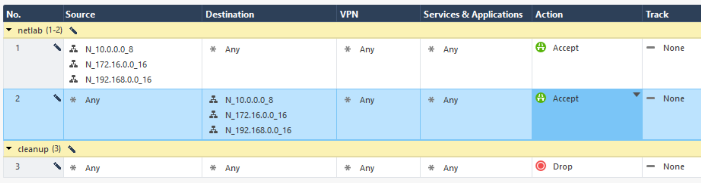
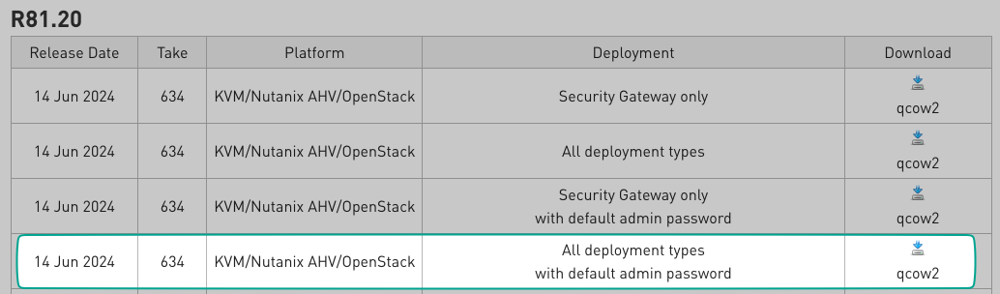

---
authors:
  - sdargoeuves
categories:
  - netlab
date:
  created: 2025-10-26
  updated: 2025-12-10
draft: false
tags:
  - netlab
  - security
title: "Add a Check Point firewall in your virtual lab: from qcow to netlab by creating a Vagrant box"
---

You might have read the [blog post](../2025-06-netlab-fortigate-vm/index.md) about creating a FortiGate Vagrant box to use in your virtual lab. This time, I wanted to add a Check Point firewall — similar idea, but with **significantly** more quirks along the way.

<!-- more -->

![The image is a digitally rendered, highly stylised, and futuristic representation of a virtualised computing environment, set within what appears to be a server room or data centre. At its core, a central stack of three glowing, transparent, nested cubes is prominently displayed. The innermost cube radiates a bright, energetic light, symbolising a key component like a Check Point Firewall running as a virtual machine or within a container. These luminous virtual layers are enclosed within a larger, dark structure resembling a server rack, highlighting the concept of a secure, layered virtualised deployment within a physical infrastructure.](inception-boxes.png){ width=600 }
/// caption
<!-- keep empty to center the image, without a caption -->
///

## Introduction

!!! info "Disclaimer"
    This post will look similar to the FortiGate guide I did a little while ago, but it was a lot more fiddly to arrive at a working solution for Check Point.

### Overview

Welcome to this fairly long post — but don't worry, we'll walk through it step by step. The goal is to guide you through deploying a Check Point firewall in your lab, from downloading the image to having a working firewall in *netlab*.

**Here is what we are going to do:**

- Create and configure a standalone Check Point firewall VM from the official KVM image
- Configure the management interface with your chosen IP address
- Run the First Time Wizard (via CLI) and apply additional settings
- Build a Vagrant box from the VM
- Use the box with *netlab* to deploy a Check Point firewall in your lab

We will be using the CloudGuard image, configured as a standalone, so you won't need multiple servers, just one VM.

### Important Limitation: Static Management IP

!!! warning "Management IP Address Constraint"
    **Unlike most Vagrant boxes, this Check Point box requires a statically pre-configured management IP address.**

    This limitation is discussed on the [Check Point community forum](https://community.checkpoint.com/t5/CloudMates-General/Management-Interface-eth0-assigned-via-DHCP-cannot-remove-the/m-p/259419#M608). I explored several workarounds (including attaching ISOs dynamically), but this pre‑configuration approach was the only one I found reliable.

    **Why?** Check Point's First Time Wizard hardcodes the management IP into the system configuration. When you run `vagrant up`, the VM boots with this pre-set IP, which cannot be changed dynamically.
    
    As explained by Check Point support on the forum:
    
    > Dynamic IP address for the management server is not supported. Even if you find a reliable way to update your MGMT IP address on the management object itself, this situation is not covered by the product design.
    >
    > Once your MGMT server IP changes, you will lose the ability to install policy and to maintain certificates. MGMT to GW communication is covered by the implied rules, and the SMS IP is hardcoded there when you install the policy. The CRL distribution point will not be available for certificate validation, and SIC will also not work once the MGMT IP shifts.
    
    **What this means for you:**
    
    - Each Vagrant box you create will have a **fixed management IP**
    - You'll need to create separate boxes for different management subnets
    - The management IP must match what you'll use in your *netlab* topology
    - Changing the IP post-creation will break policy installation and certificate management
    
    **Example:** If you plan to use `10.194.59.200` for Check Point management IP in your *netlab* environment, create your box with that IP. If you need a different IP (`192.168.1.100`), you'll need to create another box. 
    
    !!! note "Matching IP Addresses"
        Ensure the management IP in your *netlab* topology matches the one used during box creation. You can influence the management IP by adjusting the `id` field in your *netlab* topology file.

### Prerequisites

To follow this guide, you'll need:

!!! note "Check Point image"
    An account on the [Check Point support portal](https://support.checkpoint.com/) so you can download the Check Point CloudGuard image.

!!! note "System Requirements"
    **Hardware requirements** (based on this [Check Point document](https://sc1.checkpoint.com/documents/R81.20/WebAdminGuides/EN/CP_R81.20_RN/Content/Topics-RN/Open-Server-Hardware-Requirements.htm?tocpath=Open%20Server%20Hardware%20Requirements%7C_____0#Open_Server_Hardware_Requirements))

    - **CPU:** 4 vCPU
    - **RAM:** 8 GB 
    - **Disk Space:** ~110GB free disk space

!!! note "*netlab*"
    You have a working installation of *netlab*, if not, check their [installation guide](https://netlab.tools/install/) and ensure you have the `libvirt` provider working. I would also recommend having Docker to use containerlab for other devices in the lab (i.e. Arista cEOS)

## TL;DR

If you just want to get a Check Point FW in your lab, I've created a bash script which will perform all the required steps to create the vagrant box. You can then use this box in your *netlab* topology.

Go to the [GitHub repository](https://github.com/sdargoeuves/automate_checkpoint_lab), follow the instructions in the README file to create your box and use it in your *netlab* topology. You will still need to download the Check Point image manually: [CloudGuard Network Security Gateway for Linux KVM (R81.20)](https://support.checkpoint.com/results/download/133476)

## Phase 1 - Prepare the ISO configuration file

This is a key part as we do not want to go through the First Time Wizard manually each time we create a new box. We are going to prepare an ISO file which will be attached to the VM during the box creation process to perform the initial configuration automatically.

It goes further than just the First Time Wizard... more on this below!

### Create directory structure

The directory structure is important! This is documented on the Check Point support portal: [How to provide user data in KVM with Configuration Drive](https://support.checkpoint.com/results/sk/sk180452)

The file structure must be as follows for Check Point to read it correctly:

```bash
mkdir -p "file_structure/openstack/2015-10-15"
cd file_structure/openstack/2015-10-15
```

### Create the user_data file

All the information you need to create the file and its content is available on the Check Point support portal: [CloudGuard Network Security - How to configure cloud-init automation](https://support.checkpoint.com/results/sk/sk179752), but don't worry, I'll guide you through it.

The file name must be `user_data` and the content is in YAML format. Here is the breakdown of the content we need to add to the file.

#### Basic configuration and network settings

!!! note "Management IP Address"
    This IP address must match what you will use in your *netlab* topology.

```bash
#cloud-config
#
# user-data file for Check Point R81.20
#
# For more information, see:
# - https://support.checkpoint.com/results/sk/sk179752
# - https://community.checkpoint.com/t5/General-Topics/Management-Interface-eth0-assigned-via-DHCP-cannot-remove-the/m-p/259712

# Set the hostname & admin password
hostname: cp-gateway
password: admin123
### Configure the network
network:
  version: 1
  config:
    - type: physical
      name: eth0
      subnets:
        - type: static
          address: 10.194.58.200
          netmask: 255.255.255.0
          gateway: 10.194.58.1
```

I don't think this part of the file needs much explanation, just ensure you set the correct static IP address, netmask, and gateway for your management interface (eth0).

**Why configure a static IP here?** If you remove the `network` section, the VM will get an IP address via DHCP during the boot process. While this works initially, Check Point records this DHCP-assigned IP as the management server address. Later, when you create a VM from this box, if the DHCP server assigns a *different* IP address to eth0, it will create a mismatch that breaks policy installation, certificate management, and other critical functions that depend on the management IP remaining consistent.

By configuring a static IP now, we ensure the management IP matches what you'll use in your *netlab* topology.

#### RUNCMD section

The `runcmd` section allows us to run commands after the initial setup. This is where we will automate the First Time Wizard and other configurations.

```yaml
runcmd:
```

##### RUNCMD > First Time Wizard commands

The First Time Wizard automates the initial setup that would normally require manual steps through the web interface. We use the `config_system` command with specific parameters:

```yaml
  ### Run First Time Wizard configuration
  # maintenance_hash was generated with the password admin123
  # You can generate a new hash by using the command 'grub-mkpasswd-pbkdf2', before recreating the VM.
  - echo "RUNCMD> Running First Time Wizard configuration..."
  - |
    config_system -s "install_security_gw=true\
    &install_security_managment=true\
    &install_mgmt_primary=true\
    &mgmt_admin_radio=gaia_admin\
    &mgmt_gui_clients_radio=any\
    &maintenance_hash='grub.pbkdf2.sha512.10000.721029F548E36425A9E20E1454D0946E4A0C2ECE23250E6817C31556251C3F47BE7CE164114279E18C9D9783DCD2E3418C68AE0CD9007E437716195FC16CF005.EA75DE1D489B04E5EAEDB8010D60F4CE929F455E61B4EF9CB2E5E133BD974A2EEFC4F89EDD1A17CCDC448FDCDC711804FC04DB14E68CDCD70FA3881C0AB346E3'\
    &ftw_sic_key=aaaa\
    &primary=1.1.1.1\
    &timezone='Etc/GMT'\
    &upload_info=false\
    &upload_crash_data=false\
    &download_from_checkpoint_non_security=false\
    &download_info=false\
    &reboot_if_required=true" 2>&1 | tee /tmp/ftw_output.txt
    
    if grep -q "First time configuration was completed!" /tmp/ftw_output.txt; then
      echo "RUNCMD> First Time Wizard completed successfully, waiting for reboot..."
      sleep 60
    else
      echo "RUNCMD> First Time Wizard skipped (already installed or failed), continuing..."
    fi
    rm -f /tmp/ftw_output.txt
```

**Key parameters:**

- Installs both Security Gateway and Management Server (standalone mode)
- Uses the Gaia admin account for management
- Allows GUI access from any IP address
- Sets maintenance password to `admin123` (pre-generated hash)
- Disables telemetry and automatic updates
- Triggers a reboot after completion

!!! note "Password Hash"
    The `maintenance_hash` was generated using `grub-mkpasswd-pbkdf2` with password `admin123`.
    You can generate your own hash if you want to use a different password.

We check the output to determine if the First Time Wizard completed successfully or was skipped (if already executed, after the initial reboot). If completed, we wait 60 seconds for the system to begin rebooting before continuing. Without this delay, subsequent commands might execute while the system is mid-reboot, causing configuration failures.

##### RUNCMD > Set expert mode

Set the expert password non-interactively using a temporary file:

```yaml
  ### Set expert password (non-interactive)
  - echo "RUNCMD> Setting expert password..."
  - |
    cat > /tmp/expert_pwd.txt << 'EOFPWD'
    admin123
    admin123
    EOFPWD
    clish -c "set expert-password" < /tmp/expert_pwd.txt
    rm /tmp/expert_pwd.txt
```

This creates a temporary file with the password (entered twice as required by the prompt), then feeds it to the `set expert-password` command. The expert password is needed to access advanced features and configuration options.

##### RUNCMD > Create vagrant user

Create the vagrant user with sudo privileges and SSH key authentication:

```yaml

  ### Create user vagrant
  - echo "RUNCMD> Create user 'vagrant'..."
  - clish -c "set password-controls complexity 1"
  - clish -c "add user vagrant uid 2000 homedir /home/vagrant"
  - clish -c "add rba user vagrant roles adminRole"
  - clish -c "set user vagrant shell /bin/bash"
  - clish -c "set user vagrant newpass vagrant"
  - echo "RUNCMD> Configuring sudoers for user 'vagrant'..."
  - |
    cat >> /etc/sudoers << 'EOFSUDO'

    ## For vagrant box
    vagrant ALL=(ALL) NOPASSWD: ALL

    EOFSUDO

  ### Set up vagrant user for SSH access
  - echo "RUNCMD> Setting up SSH access for user 'vagrant'..."
  - |
    mkdir -p /home/vagrant/.ssh
    cat > /home/vagrant/.ssh/authorized_keys << 'EOFSSH'
    ssh-rsa AAAAB3NzaC1yc2EAAAABIwAAAQEA6NF8iallvQVp22WDkTkyrtvp9eWW6A8YVr+kz4TjGYe7gHzIw+niNltGEFHzD8+v1I2YJ6oXevct1YeS0o9HZyN1Q9qgCgzUFtdOKLv6IedplqoPkcmF0aYet2PkEDo3MlTBckFXPITAMzF8dJSIFo9D8HfdOV0IAdx4O7PtixWKn5y2hMNG0zQPyUecp4pzC6kivAIhyfHilFR61RGL+GPXQ2MWZWFYbAGjyiYJnAmCP3NOTd0jMZEnDkbUvxhMmBYSdETk1rRgm+R4LOzFUGaHqHDLKLX+FIPKcF96hrucXzcWyLbIbEgE98OHlnVYCzRdK8jlqm8tehUc9c9WhQ== vagrant insecure public key
    EOFSSH
    chmod 700 /home/vagrant/.ssh
    chmod 600 /home/vagrant/.ssh/authorized_keys
    chown -R vagrant:users /home/vagrant/.ssh
```

This configures the vagrant user that Vagrant will use to connect to the VM:

- Creates user with admin role and bash shell
- Grants passwordless sudo access
- Installs Vagrant's insecure public key for SSH authentication

##### RUNCMD > Enable DHCP on eth0

**Wait, enabling DHCP? But you said we don't want that...** Yes! Here's why we need that:

```yaml
  ### Enable DHCP client on eth0 to allow dynamic IP assignment (although it should be the IP configured statically above)
  - echo "RUNCMD> Enabling DHCP client on eth0..."
  - |
    clish -c "add dhcp client interface eth0"
    clish -c "save config"
```

This seems contradictory, but it's necessary for Vagrant compatibility:

- **Static IP during First Time Wizard** → Check Point configures the Security Management Server address using eth0's static IP (defined as `10.194.58.200` in my example). If you use DHCP at this stage, it will likely assign an IP from the default Vagrant subnet, probably not the one used by *netlab*. Additionally, Vagrant cannot reliably detect the IP unless DHCP is enabled.
- **DHCP enabled afterwards** → the Security Gateway `eth0` will now get its IP via DHCP, allowing Vagrant to detect it. As long as DHCP assigns the same IP (`10.194.58.200`) it will match the IP of the Security Management Server.

**The key:** Your *netlab* topology must assign the **same IP** (`10.194.58.200`). When done correctly, Check Point's management system and Vagrant's detection both work correctly.

This is why DHCP is essential: without it, `vagrant up` will fail to detect the IP of the VM, and timeout.

##### RUNCMD > Create Time loop

**Trap the VM in a time loop** to, let's just say this keeps things... fresh 😏 by performing these steps:

```yaml
  ### Device enters a time loop
  - echo "RUNCMD> Configuring time loop..."
  - |
    # Capture the creation date and day of week (this will be baked into the box)
    CREATION_DATE="\$(date '+%d %b %Y %H:%M:%S')"
    CREATION_DOW="\$(date '+%u')"
    
    # Set date at boot time via rc.local (always reset to creation date)
    cat >> /etc/rc.d/rc.local << EOFBOOT
    # Set Check Point date to box creation date at every boot
    /usr/bin/date -s "\${CREATION_DATE}" && /sbin/hwclock -w
    EOFBOOT
    chmod +x /etc/rc.d/rc.local
    
    # Create weekly cron job to reset date (every week on the same day as creation)
    cat > /etc/cron.d/reset-date << EOFTIME
    # Reset Check Point date to box creation date every week on the same day at 1:00 AM to avoid license expiration
    0 1 * * \${CREATION_DOW} root /usr/bin/date -s "\${CREATION_DATE}" && /sbin/hwclock -w
    EOFTIME
    chmod 644 /etc/cron.d/reset-date
    chown root:root /etc/cron.d/reset-date

```

The above script resets the system time using two mechanisms:

- **At boot**: VM always starts with the box creation date
- **Weekly**: Cron job resets to creation date every week (same day, 1:00 AM)

It means the VM will never be more than 7 days old... you may find it useful 🙈🙉🙊

!!! warning "Lab Use Only"
    This time-reset approach is intended **strictly for lab environments**.

##### RUNCMD > Configure API settings to accept calls from all IP addresses that can be used for GUI clients

Last part of the RUNCMD, we will allow API access to the management server from all IP addresses that can be used for GUI clients. This is important if you want to manage the Check Point firewall automatically, rather than manually via the web interface.

I've decided to use a retry logic here, as it can take a few minutes after the First Time Wizard for the API to be available.

```yaml
  ### Configure API settings to accept calls from all IP addresses that can be used for GUI clients (with retry logic)
  - echo ""
  - echo "RUNCMD> Configure via mgmt_cli to accept API calls from all IP addresses that can be used for GUI clients... (>3min wait)"
  - |
    # Retry logic: attempt several times with 20-second waits (it takes at least 3 minutes to be able to login)
    MAX_RETRIES=10
    SLEEP_INTERVAL=20
    RETRY_COUNT=0
    SUCCESS=0
    
    while [ \$RETRY_COUNT -lt \$MAX_RETRIES ]; do
      echo "Attempt \$((RETRY_COUNT + 1)) of \$MAX_RETRIES..."
      
      # Try to login directly (API runs on port 443)
      SESSION_FILE=\$(mktemp)
      
      if mgmt_cli --port 443 -d "System Data" -r true login > "\${SESSION_FILE}" 2>&1; then
        echo "API login successful, configuring settings..."
        mgmt_cli --port 443 -s "\${SESSION_FILE}" set api-settings accepted-api-calls-from "All IP addresses that can be used for GUI clients"
        mgmt_cli --port 443 -s "\${SESSION_FILE}" publish
        mgmt_cli --port 443 -s "\${SESSION_FILE}" logout
        rm "\${SESSION_FILE}"
        echo "API configuration completed successfully"
        SUCCESS=1
        break
      else
        echo "API login failed. Error details:"
        cat "\${SESSION_FILE}"
        echo "---"
        rm -f "\${SESSION_FILE}"
      fi
      
      RETRY_COUNT=\$((RETRY_COUNT + 1))
      if [ \$RETRY_COUNT -lt \$MAX_RETRIES ]; then
        echo "Waiting \$SLEEP_INTERVAL seconds before retry..."
        sleep \$SLEEP_INTERVAL
      fi
    done
    
    if [ \$SUCCESS -eq 0 ]; then
      echo "WARNING: Failed to configure API settings after \$MAX_RETRIES attempts"
      echo "You may need to configure API settings manually via SmartConsole"
    fi
```

This configuration:

- **Waits for API availability**: The management API can take a little while to start
- **Retries automatically**: Attempts connection 10 times with 20-second intervals
- **Enables remote access**: Allows API calls from all IP addresses that can be used for GUI clients
- **Graceful fallback**: Provides warning if automatic configuration fails

Without this configuration, you can only access the API from localhost, which limits remote management capabilities, especially if you are trying to automate tasks. The embedded smartconsole would still work without this but has limited functionality.

### Create the ISO file

You can now create the ISO file, which will be attached to the VM, using the `genisoimage` command:

```bash
genisoimage -r -V config-2 -o "cp_config.iso" "file_structure/"
```

**What this does:**

- `-r`: Rock Ridge extensions (preserves Unix permissions and file ownership)
- `-V config-2`: Volume label that Check Point looks for
- `-o "cp_config.iso"`: Output filename
- `"file_structure/"`: Directory containing our configuration

**Important:** The volume label **must** be `config-2` - this is the identifier Check Point's cloud-init looks for when reading the configuration drive.

**Verify the ISO:**

```bash
ls -lh cp_config.iso
file cp_config.iso
```

The expected output should be:

```bash {: .no-copy}
╰─❯ ls -lh cp_config.iso                    
.rw-rw-r-- libvirt-qemu kvm 362 KB Fri Oct 31 23:43:03 2025  cp_config.iso

╰─❯ file cp_config.iso  
cp_config.iso: ISO 9660 CD-ROM filesystem data 'config-2'
```

You now have the `cp_config.iso` file which contains all the steps we've configured above, we will just need to attach it to the VM during the box creation process.

## Phase 2 - Create and initialize the Check Point VM

### Download the Check Point QCOW2 Image

=== "R81.20"

    [CloudGuard Network Security Gateway for Linux KVM (R81.20)](https://support.checkpoint.com/results/download/133476)
<!-- 
=== "R82"

    [CloudGuard Network Security Gateway for Linux KVM (R82)](https://support.checkpoint.com/results/download/135457) -->

### Start the VM using the ISO configuration file

Make a copy of the qcow2 image so that you don't modify the original one, the copy will be used as the hard disk for the VM.

=== "R81.20"

    ```bash
    cp ivory_main-634-991001608_unsecured.qcow2 cp-hd.qcow2
    ```
<!-- 
=== "R82"

    ```bash
    cp jaguar_opt_main-777-991001696_unsecured.qcow2 cp-hd.qcow2
    ``` -->

You can now start the VM using the configuration ISO we created earlier, with `virt-install`:

```bash
virt-install \\
  --name="checkpoint-vm" \
  --vcpus=2 \
  --ram=8192 \
  --disk path="cp-hd.qcow2",bus="ide",format=qcow2 \
  --disk path="cp_config.iso",device=cdrom,readonly=on \
  --network=network:default,model=virtio \
  --graphics none \
  --import
```

### Wait for the VM to complete its initialization

That's it, the ISO file will take care of everything for you. If you want to monitor the progress, you can connect to the VM console using:

```bash
virsh console checkpoint-vm
```

### (Optional) Add firewall rules

By default, the Check Point firewall has only the cleanup rule enabled, which means all traffic is blocked. You can add rules using the embedded SmartConsole or, if you have a Windows machine, you can install the Check Point SmartConsole application.

During my testing, I've created quite permissive rules for private subnets (to say the least):


You could also just change the default cleanup rule to accept all traffic, it's your lab after all, you can do whatever you want!

!!! tip "Automate Firewall Rules"
    My final Vagrant box has the default cleanup rule blocking all traffic. I use the playbook to automate the firewall rules after the VM is created in *netlab*. You can find the playbook in my [GitHub repository](https://github.com/sdargoeuves/automate_checkpoint_lab).

#### Embedded SmartConsole

The embedded SmartConsole is a web interface that runs on the firewall itself. You can access it by navigating to `https://<ip-address>/smartconsole` in your web browser. This interface allows you to perform basic management tasks, such as configuring firewall policies and objects. It's quite limited, but probably enough for lab usage.

#### Windows SmartConsole

The Windows SmartConsole is an application you can install on a Windows machine. It provides a more feature-rich interface for managing the Check Point firewall, including advanced configuration options and the ability to enable API access.

If you do not have a Windows machine, you can get a Windows server running on your existing host (linux/mac or even windows 🤷‍♂️, why not?!)

> What, is that even possible?

Yes, and it was a lot easier than it sounds, thanks to Docker 🐳 and this project: [dockur/windows](https://github.com/dockur/windows)

## Phase 3 - Create the Vagrant box from the Check Point VM

Once your VM has completed its initialization and you've optionally configured firewall rules, you are ready to package it as a Vagrant box.

### Shut down the VM

First, gracefully shut down the VM:

```bash
virsh shutdown checkpoint-vm
```

Wait for the VM to fully shut down (check with `virsh list --all`).

### Package the box

A Vagrant box is essentially a tar.gz archive containing three files:

1. **box.img** - The VM disk image (your configured qcow2 file)
2. **metadata.json** - Box metadata (provider, format, size)
3. **Vagrantfile** - Default Vagrant configuration

#### Disk

Let's work in a dedicated directory for the box creation:

```bash
mkdir -p box_build
cd box_build
```

And copy our disk prepared earlier as `box.img`:

```bash
cp ../cp-hd.qcow2 box.img
```

#### Metadata

This file tells Vagrant and libvirt how to handle the disk image:

```bash
cat > metadata.json << 'EOF'
{
  "provider": "libvirt",
  "format": "qcow2",
  "virtual_size": 100
}
EOF
```

**What each field means:**

- **`provider`**: Tells Vagrant this box is for the libvirt provider (KVM/QEMU)
- **`format`**: Specifies the disk image format (qcow2)
- **`virtual_size`**: Maximum disk size in GB (100GB)

!!! note "Virtual Size vs Actual Size"
    The `virtual_size` of 100GB doesn't mean the box file is 100GB. The qcow2 format is sparse - it only uses disk space for data actually written.

#### Create Vagrantfile

This file defines the default configuration for VMs created from this box:

```bash
cat > Vagrantfile << 'EOF'
Vagrant.configure("2") do |config|
    config.vm.provider :libvirt do |libvirt|
        libvirt.driver = "kvm"
    end

    config.vm.boot_timeout = 300
    config.vm.communicator = 'ssh'
    config.vm.synced_folder ".", "/vagrant", disabled: true
    config.vm.allow_fstab_modification = false
    config.vm.allow_hosts_modification = false
    config.vm.guest = "redhat"

    config.ssh.shell = "bash"
    config.ssh.sudo_command = ""
    config.ssh.username = "vagrant"
    config.ssh.password = "vagrant"
    config.ssh.insert_key = false

    config.vm.provider :libvirt do |lv|
        lv.memory = 8192
        lv.cpus = 2
    end
end
EOF
```

**Key settings:**

- **SSH configuration**: Uses the vagrant user we created in Phase 1
- **Guest type**: Set to `redhat` to prevent Vagrant from trying to auto-detect the OS

!!! tip "Resource Adjustments"
    You can override these defaults in your*netlab*topology file if you need different resources, like more RAM or CPUs.

#### Create the box

Create the archive, which is your Vagrant box. This operation can take a few minutes depending on your disk speed.

```bash
tar czf ../checkpoint-r8120.box ./*
cd ..
```

### Add the box to Vagrant

Vagrant supports two methods for adding boxes.

#### Method 1: Using metadata

Create a metadata file that describes your box, including versioning:

```bash
cat > checkpoint-r8120_metadata.json << 'EOF'
{
  "name": "mylocal/checkpoint",
  "description": "Check Point R81.20 Security Gateway",
  "versions": [
    {
      "version": "81.20",
      "providers": [
        {
          "name": "libvirt",
          "url": "file:///absolute/path/to/checkpoint-r8120.box"
        }
      ]
    }
  ]
}
EOF
```

!!! warning "Absolute Path Required"
    Replace `/absolute/path/to/` with the full path to your box file.

Now you can add the box using the json metadata file:

```bash
vagrant box add checkpoint-r8120_metadata.json
```

**Benefits of this approach:**

- Version tracking - Vagrant knows which version you're using
- Easy updates - Add new versions to the metadata file
- Better organization - Multiple boxes can reference different versions
- Consistent naming - Box name stays the same across updates

#### Method 2: Direct import (Quick & simple)

For a quick test or single-use box, you can add it directly:

```bash
vagrant box add checkpoint-r8120 checkpoint-r8120.box
```

**When to use this:**

- Quick testing or proof of concept
- Single version only
- No need for version management

**Verify the box was added:**

```bash
vagrant box list
```

!!! success "Box Creation Complete!"
    Your Check Point Vagrant box is now ready to use with netlab! 🎉

<!-- CURRENT PROGRESS INDICATOR -->

## Using the box with netlab

Now you can create a topology file using the `mylocal/checkpoint:81.20` box or `checkpoint-r8120`. This is an example topology file:

```topology
---
message: "Check Point Lab!"

defaults.addressing.mgmt.start: 199 # the first IP will be .200 if the management subnet is a /24
defaults.devices.eos.clab.image: "ceos:4.29.9.1M"
defaults.devices.linux.clab.image: "ubuntu/nginx"
provider: libvirt

groups:
  switches:
    _auto_create: true
    device: eos
    provider: clab
    module: [ ospf, vlan ]
    members: [ sw1, sw2 ]

  allhosts:
    _auto_create: true
    device: linux
    provider: clab
    role: host
    members: [ h1, h2 ]

  unprovisioned:
    members: [ cp ]

nodes:
  cp:
    id: 1 # so it's mgmt IP is expected to be 199+1=200
    image: mylocal/checkpoint:81.20 # or checkpoint-r8120, or whatever you created earlier
    provider: libvirt
    device: linux
    memory: 8192
    cpu: 2

  sw1:
    vlans:
      user_1:
        ipv4: 1
  sw2:
    vlans:
      user_2:
        ipv4: 1

vlans:
  user_1:
    # id: 11
    ospf.passive: true
  user_2:
    # id: 12
    ospf.passive: true

links:
  - cp:
      # ipv4: 172.60.40.2/30 # netlab does not configure Check Point configuration, so we will have to do it ourselves later
    sw1:
      ipv4: 172.60.40.1/30
      ospf.passive: false
    type: p2p
  - cp:
      # ipv4: 172.60.40.6/30 # netlab does not configure Check Point configuration, so we will have to do it ourselves later
    sw2:
      ipv4: 172.60.40.5/30
      ospf.passive: false
    type: p2p
  - h1:
      ipv4: 11
    sw1:
      vlan.access: user_1
  - h2:
      ipv4: 12
    sw2:
      vlan.access: user_2
```

This will bring two Arista switches, two Linux hosts, and the Check Point firewall. You will need to configure the Check Point firewall:

- Network interfaces with the correct IP addresses,
- OSPF configuration to peer with the switches,
- Policies to allow traffic between the two hosts.

## Conclusion

By now, you’ve taken the official Check Point CloudGuard image, automated its first-time configuration, and packaged it as a reusable Vagrant box ready for *netlab*. This gives you a repeatable way to spin up a fully functional Check Point firewall in your virtual lab, with a predictable management IP and API access enabled for automation.

If you’re also using FortiGate in your lab, you can now compare behaviours and policies side by side across vendors. And of course, feel free to adapt any of the steps here — different RAM/CPU settings, other versions, or your own playbooks — to better fit your environment and use cases.

## Appendix

### Attempt with Boxen

#### Summary of the attempt with boxen

`boxen` is an interesting project, to package KVM/QEMU virtual machines into Docker containers. It can work and may work for you, but for me, having the same management IP configured on the Check Point VM and the one used to connect to it was important. Because of this, I have used the other approach, directly with running the VM with KVM/QEMU, in fact very similar to what we've done with the FortiGate VM in [this previous post](../2025-06-netlab-fortigate-vm/index.md).

#### Image preparation to use with boxen

##### 1. Download the Check Point image

This Check Point page lists the [CloudGuard Network Security for Private Cloud images](https://support.checkpoint.com/results/sk/sk158292). You don't need to be logged in to access this page, but you do to download the image. We will be using the image for the platform `KVM/Nutanix AHV/OpenStack` with the deployment type `All deployment types with default admin password`.

!!! note "Image selection"
    At the time of writing, the latest version is R82, but I went for R81_20 as I had an issue with R82, but did not explored further. Here is the direct link to the [download page for R81_20](https://support.checkpoint.com/results/download/133476).



So far so good, we now have the image downloaded, let's move to the next step. Maybe not just yet, if you need to move the downloaded image to a different server where you will be running the VM, do it now.

##### 2. Create the Docker Image with `boxen`

We are going to use [`boxen`](https://github.com/carlmontanari/boxen) to create a Docker image that will run the Check Point VM. `boxen` is a tool that simplifies the process of packaging KVM/QEMU virtual machines into Docker containers. It took me a while to grasps the concept, it's as simple as the movie Inception:

- physical server
  - netlab server (ubuntu virtualized)
    - Docker container: Ubuntu
      - QEMU to run the Check Point VM

###### Install `boxen`

It's pretty simple to install [`boxen`](https://github.com/carlmontanari/boxen):

```bash
bash -c "$(curl -sL https://raw.githubusercontent.com/carlmontanari/boxen/main/get.sh)"
```

This tool will use the qcow2 image to create a docker image

###### Create the Image

Now that we have `boxen` installed, we can create the docker image. We are using the command with debug mode to follow what is going on, a timeout multiplier of 2 as the Check Point VM can takes its time to boot, and the dev mode to avoid cleaning up the temporary files created during the process. The command is as follows:

```bash
BOXEN_LOG_LEVEL=debug BOXEN_TIMEOUT_MULTIPLIER=2 BOXEN_DEV_MODE=1 \
boxen package --disk cp_r82_boxen.qcow2 --vendor checkpoint --platform cloudguard --version R82
```

###### Verify the Image

You can verify that the image has been created with the following command:

```bash
docker images | grep boxen
```

And that's it for the `boxen` part, we now have a Docker image with the Check Point VM inside. Next step is to run it and configure it. I am afraid this is where I've lost my notes, it worked, but not in the way I was expecting.
This may work for you, but for me, having the same management IP configured on the Check Point VM and the one used to connect to it was important. Because of this, I have used the other approach, directly with running the VM with KVM/QEMU, infact very similar to what we've done with the FortiGate VM in [this previous post](../2025-06-netlab-fortigate-vm/index.md).

